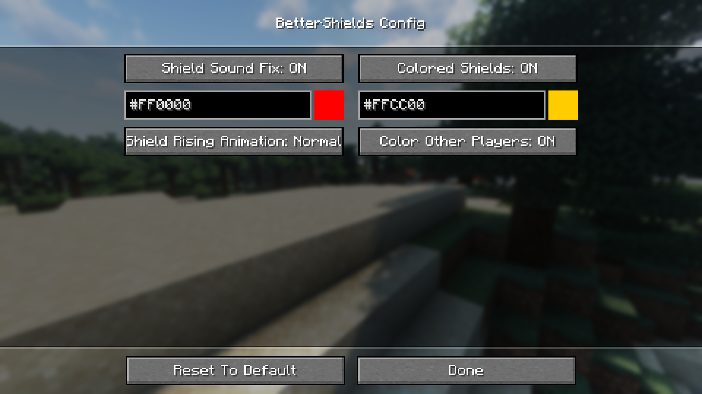
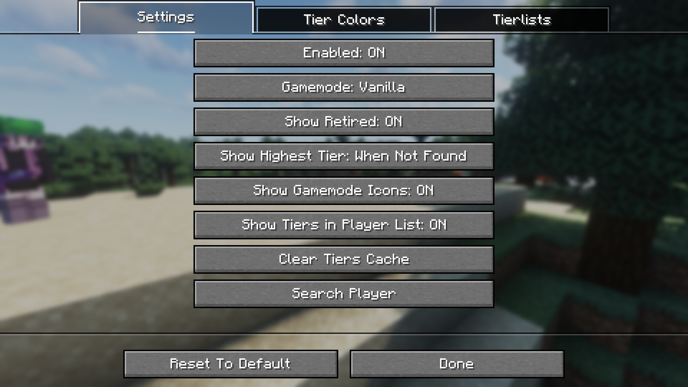

# Configuration screens

ukulib provides multiple ways of easily creating screens to manage your mod's configuration. These screens try to stay as inline as possible with what you can find in the vanilla game, while trying to provide a better API.

## Common concepts

Essentially, a config screen is composed of a list of [`WidgetCreator`](https://maven.uku3lig.net/javadoc/releases/net/uku3lig/ukulib-common/latest/.cache/unpack/net/uku3lig/ukulib/config/option/WidgetCreator.html)'s. Each one (usually) represents and "wraps" a single value in your configuration, and will display a widget that allows editing the value in the most appropriate manner. ukulib provides a bunch of them already, which should cover the vast majority of cases.

Each `WidgetCreator` will have a different constructor signature but they all have a few parameters in common:

- a translation key, which should translate to something that describes in a fairly concise manner what the option does (eg. `#!java "betterhurtcam.config.enabled"` which translates to `Hurtcam enabled`)
- a value, which will serve as the initial value for the widget when the screen is shown (eg. `#!java config.enabled` or `#!java config.isEnabled()`)
- a setter, usually a lambda for convenience (eg. `#!java (v) -> config.enabled = v` or `#!java config::setEnabled`),
- (optional) a tooltip, if you have a complicated option and want to display more information. This parameter uses Mojang's `OptionInstance.TooltipFactory`, which has a few static methods for most common cases, like `noTooltip()` and `cachedConstantTooltip(Component)`.

As an example, creating a simple on/off button:

```java
CyclingOption.ofBoolean(
    // this can be anything you want, as long as it's in your translations file
    "mymod.option.enableMeowing",
    // we don't need a lambda here due to how ukulib works
    config.meowingEnabled,
    // this is called every time the value is changed
    (v) -> config.meowingEnabled = v,
    // this parameter can be omitted if you don't need it
    OptionInstance.cachedConstantTooltip(Component.translatable("mymod.explanation.meowing"))
);
```

You can find a list of widgets and their usages on the [Widgets](widgets.md) page.

## Config screen types

### Vanilla-like config screen

{ width=520 style="margin-inline:auto;display:block" }

[`AbstractConfigScreen`](https://maven.uku3lig.net/javadoc/releases/net/uku3lig/ukulib-common/latest/.cache/unpack/net/uku3lig/ukulib/config/screen/AbstractConfigScreen.html) implements a vanilla-like config screen, similar do what you would find in most option screens in-game.

Only a singular constructor and method need to be implemented:

```java title="MyModConfigScreen.java"
public class MyModConfigScreen extends AbstractConfigScreen<MyModConfig> {
    protected MyModConfigScreen(Screen parent) {
        super("mymod.config.title", parent, MyMod.getManager());
    }

    @Override
    protected WidgetCreator[] getWidgets(MyModConfig config) {
        return new WidgetCreator[]{
            CyclingOption.ofBoolean("mymod.option.enableMeowing", config.isMeowingEnabled(), config::setMeowingEnabled),
        };
    }
}
```

The constructor takes 3 arguments: a translation key for the screen's title, the parent/previous screen, and a config manager. `getWidgets` supplies you with an instance of your config, to avoid having to repeatedly call the manager and to make the function "pure".

### Tabbed config screen

{ width=520 style="margin-inline:auto;display:block" }

[`TabbedConfigScreen`](https://maven.uku3lig.net/javadoc/releases/net/uku3lig/ukulib-common/latest/.cache/unpack/net/uku3lig/ukulib/config/screen/TabbedConfigScreen.html) implements a config screen with mutliple tabs, similar to the world creation screen. Using it is a bit more cumbersome, as you'll need to create classes extending [`ButtonTab`](https://maven.uku3lig.net/javadoc/releases/net/uku3lig/ukulib-common/latest/.cache/unpack/net/uku3lig/ukulib/config/option/widget/ButtonTab.html).

!!! tip

    `TabbedConfigScreen` accepts any class that extends Minecraft's `Tab`, which means you can make your own more complex tabs and integrate them with the rest of the config screen seamlessly!

```java title="MyModConfigScreen.java"
public class MyModConfigScreen extends TabbedConfigScreen<MyModConfig> {
    public MyModConfigScreen(Screen parent) {
        super("mymod.config.title", parent, TotemCounter.getManager());
    }

    @Override
    protected Tab[] getTabs(MyModConfig config) {
        return new Tab[]{ new TabOne(), new TabTwo() };
    }

    public class TabOne extends ButtonTab<MyModConfig> {
        public TabOne() {
            super("mymod.config.tabOne", MyModConfigScreen.this.manager);
        }

        @Override
        public WidgetCreator[] getWidgets(MyModConfig config) {
            return new WidgetCreator[]{ /* ... */ };
        }
    }

    public class TabTwo extends ButtonTab<MyModConfig> {
        public TabTwo() {
            super("mymod.config.tabTwo", MyModConfigScreen.this.manager);
        }

        @Override
        public WidgetCreator[] getWidgets(MyModConfig config) {
            return new WidgetCreator[]{ /* ... */ };
        }
    }
}
```

## Displaying the screen

Every ukulib config screen class extends Minecraft's `Screen`, so you can just add a button somewhere into the screen of your choice and call `#!java Minecraft.getMinecraft().setScreen(new MyModConfigScreen(parent))`.

However, for convenience's sake, ukulib provides methods to access the config screens easily, either via the "uku button" or your platform's native[^1] configuration implementation.

Integrating your config screen is very straightforward: just implement [`UkulibAPI`](https://maven.uku3lig.net/javadoc/releases/net/uku3lig/ukulib-common/latest/.cache/unpack/net/uku3lig/ukulib/api/UkulibAPI.html).

```java title="UkulibIntegration.java"
import net.uku3lig.ukulib.api.UkulibAPI;

public class UkulibIntegration implements UkulibAPI {
    @Override
    public UnaryOperator<Screen> supplyConfigScreen() {
        return (parent) -> new MyModConfigScreen(parent, /* other params if needed */); // (1)!
    }
}
```

1. We use a lambda that provides the parent screen to ensure that when the user presses "Done" or <kbd>Esc</kbd>, we go back to the screen they were previously on.

Next, we need to tell ukulib that the integration class is available, which is done differently depending on the platform.

=== ":fabric: Fabric"

    In your `fabric.mod.json`, add your class to the list of ukulib entrypoints:

    ```json title="fabric.mod.json"
    {
      "entrypoints": {
        "ukulib": ["org.example.yourmod.UkulibIntegration"]
      }
    }
    ```

=== ":neoforge: NeoForge"

    In your mod class, register your integration class as an extension point:

    ```java title="MyModNeoForge.java"
    import net.uku3lig.ukulib.neoforge.UkulibNFProvider;

    @Mod(value = "mymod", dist = Dist.CLIENT)
    public class MyModNeoForge {
        public MyModNeoForge(ModContainer container) {
            container.registerExtensionPoint(UkulibNFProvider.class, UkulibIntegration::new);
        }
    }
    ```

    !!! note

        You may notice that we are using a separate `UkulibNFProvider` class here and using a lambda instead of just instantiating `UkulibIntegration`: this is due to NeoForge requiring extension points to implement `IExtensionPoint`, which is not available in the platform-independent code of ukulib, where `UkulibAPI` resides.

And that's it! Your mod should now appear in the list of ukulib mods and its config screen should be accessible via Mod Menu/NeoForge's mod list!

[^1]: This techincally isn't native on Fabric since it doesn't provide anything for it, so ukulib relies on [Mod Menu](https://modrinth.com/mod/modmenu) instead, which is basically as good as it gets.
