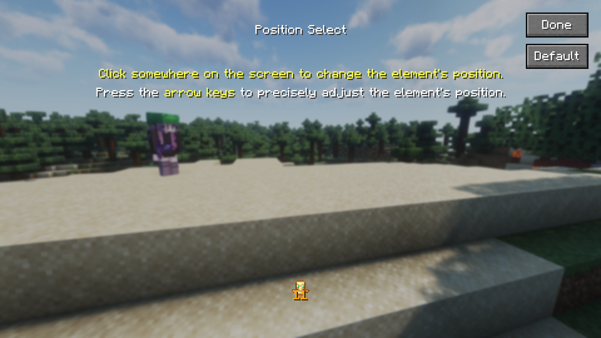

# Widgets

You can find a [list of all the available widgets](https://maven.uku3lig.net/javadoc/releases/net/uku3lig/ukulib-common/latest/.cache/unpack/net/uku3lig/ukulib/config/option/package-summary.html) in the javadoc. Most stuff should be self-explanatory thanks to the already existing javadoc comments; this page details more complex use cases and widgets.

## `CyclingOption`

`CyclingOption` is one of the more complex widget types due to the multitude of ways it can be used in. The three main usages are:

- A boolean toggle: this is the simplest one, they are constructed with the `ofBoolean` methods and just take in the "usual" parameters.
- Choosing an enum value: this (obviously) only works with actual enums, so that the values can be fetched automatically, you therefore have to pass the class of your enum and (optionally) a function that converts enum variants to human-friendly text. Constructed using `ofEnum`.
- Choosing an generic object: the most generic of the three, takes in a list of `T` and makes the "value-to-text" function mandatory. Constructed via the class constructor.

!!! tip

    Creating a "value-to-text" function can be cumbersome and annoying for most use cases, which is why `CyclingOption` also provides `ofTranslatableEnum` and `ofTranslatable` (for generic objects) functions. These require your items to implement [`StringTranslatable`](https://maven.uku3lig.net/javadoc/releases/net/uku3lig/ukulib-common/latest/.cache/unpack/net/uku3lig/ukulib/config/option/StringTranslatable.html), which associates each value with an internal string identifier and a translation key.

    *Example:*

    ```java
    @Getter
    @AllArgsConstructor // (1)!
    public enum OffhandSlotBehavior implements StringTranslatable {
        ALWAYS_IGNORE("always_ignore", "armorhud.option.alwaysIgnore"),
        ADHERE("adhere", "armorhud.option.adhere"),
        ALWAYS_LEAVE_SPACE("always_leave_space", "armorhud.option.alwaysLeaveSpace");

        private final String name;
        private final String translationKey;
    }
    ```

    1. I use [Lombok](https://projectlombok.org) here which helps writing less boilerplate; this example would work perfectly fine by writing the constructor and overriding the methods by hand.

## `InputOption` and validation

ukulib provides a few widgets for text input, namely `InputOption`. It's fairly simple at its core, taking in a translation key, an initial value and a setter.

However, its behavior can be fine-tuned with two more options: `maxLength` (self-explanatory) and a validator. This validator is a function that takes in the current value of the input and returns a boolean, `true` if the value is valid. This allows for check for virtually anything, eg. if the value is alphanumeric, if it's a valid UUID, etc.

Having a validation function set will prevent the user from saving their changes to the config if the value they put in is invalid, by disabling the "Done" button and showing a tooltip indicating what's wrong. (Note: it currently isn't possible to customize the message displayed in the tooltip). The screen can also be forcibly exited by pressing <kbd>Esc</kbd>, but modifications will not be saved.

```java title="Validated InputOption example"
new InputOption(
    // usual options: translation key, initial value, setter
    "mymod.config.playerName",
    config.getPlayerName(),
    config::setPlayerName,
    // this is the validator function, string -> boolean
    // in this example we check that the string is alphanumeric (including dashes and underscores)
    value -> value.toLowerCase(Locale.ROOT).matches("[a-z0-9_-]+"),
    // this is the maximum length of the string
    // it's automatically checked by ukulib so no need to include it in the above function
    16
);
```

### `TypedInputOption`

Sometimes the only type of widget for your need is a text input box, but the value you want to be configurable is not a string. This is where [`TypedInputOption`](https://maven.uku3lig.net/javadoc/releases/net/uku3lig/ukulib-common/latest/.cache/unpack/net/uku3lig/ukulib/config/option/TypedInputOption.html) comes in, which allows you to easily convert between a value and its string representation.

It takes the same arguments as `InputOption`, except for an additional parameter: a function converting a string to an `Optional<T>`. The optional should be empty if the conversion fails. Furthermore, the `initialValue` parameter is a string, to force the developer to handle the `T -> String` conversion; the simplest way is to use `#!String.valueOf()`.

```java title="TypedInputOption example"
private Optional<Integer> convert(String value) {
    try {
        return Optional.of(Integer.parseInt(value));
    } catch (Exception e) {
        return Optional.empty();
    }
}

// ...

new TypedInputOption<Integer>(
    "mymod.config.maxCount",
    // the value is just an integer, so the default string representation suffices
    String.valueOf(config.getMaxCount()),
    config::setMaxCount,
    // conversion function
    s -> convert(s),
    // you can still use a validator! instead of a string, the function will validate the converted value directly
    v -> v > 0
);
```

## Interactive position selection

{ width=520 style="margin-inline:auto;display:block" }

When making a client-side mod with HUD/UI elements, it may sometimes be desirable to make that element have its position be configurable. You can always use the more "traditional" method of having a `Position` enum or let the user enter coordinates by hand.

ukulib provides [`PositionSelectScreen`](https://maven.uku3lig.net/javadoc/releases/net/uku3lig/ukulib-common/latest/.cache/unpack/net/uku3lig/ukulib/config/screen/PositionSelectScreen.html), an abstract class that you can extend for a pretty configuration screen.

The only method which needs to be implemented is `draw`, which draws your element on the screen. When the user clicks clicks the "Default" button, `x` and `y` are set to -1 and `drawDefault` is called instead, which you can override to compute a default value for x and y, and then call `draw` with those values. You can see a real-world example in [TotemCounter](https://github.com/uku3lig/totemcounter/blob/3a4fbceecfc0dbf0b26f8a95d1c39f339ec9d64d/src/main/java/net/uku3lig/totemcounter/config/DisplayPositionSelectScreen.java).

When your position selection screen is fully implemented, you can easily display it with a [`ScreenOpenButton`]:

```java title="MyModConfigScreen.java"
// in case you just need to name your button "Position", ukulib already provides a translation key for it
new ScreenOpenButton("ukulib.position", parent -> new MyPositionSelectionScreen(parent, config))
```

## Wide widgets

In the case of config screens with more than one column of widgets, you can force a widget to take up the entire width by calling `.wide()` on it:

```java
new SimpleButton(/* ... */).wide()
```
